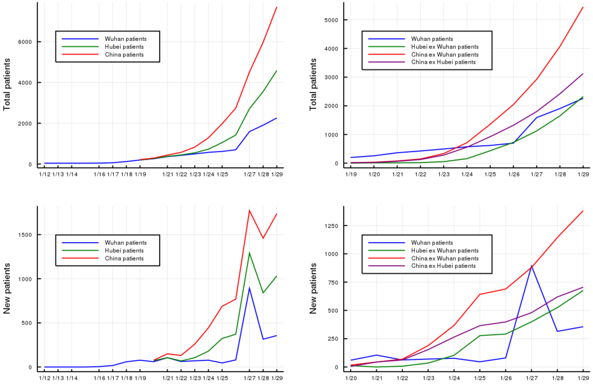
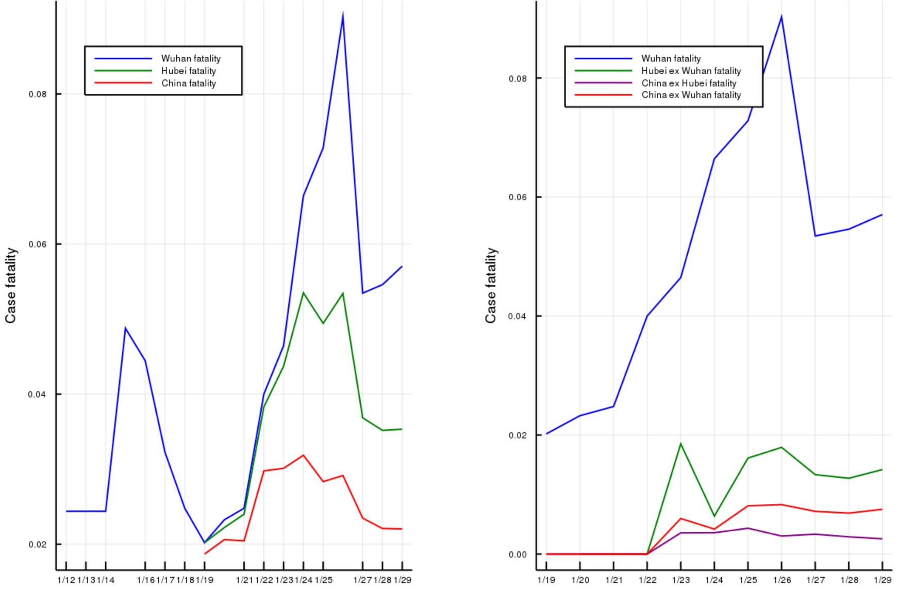

# Julia code and data to analyze the outbreak of 2019-nCov virus in China

# Description
The project is to track and analyze the published patients data in Wuhan, Hubei and China. Based on our analysis, the patients data published by Wuhan administration seems much abnormal compared with those published by Hubei and China NHC administrations.

# Data sources
China national epidemic data updates: http://www.nhc.gov.cn/xcs/yqtb/list_gzbd.shtml 

Hubei epidemic data updates: http://wjw.hubei.gov.cn/fbjd/tzgg/

# Analysis outcome

## Patients data analysis

## Death data analysis

## Case fatality analysis

# Prerequisites
The project uses Julia 1.2 to analyze the data. 
